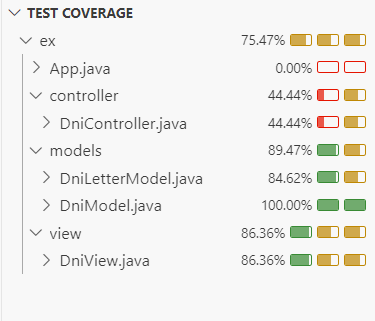

# Kata---DNI

Modulate a console application that calculates the letter of the DNI (National Identity Document).

The algorithm to calculate the letter of the DNI is as follows:
The number must be between 0 and 99999999
We take the complete number of up to 8 digits of our DNI, we divide it by 23 and we keep the rest of said division (module 23)
Depending on the result, from 0 to 22, you will be assigned one of the following letters: (T, R, W, A, G, M, Y, F, P, D, X, B, N, J, Z, S, Q, V, H, L, C, K, E)
If the data entered is not a number, it must be indicated with a message that "the data entered is incorrect" and ask again.
The process must be repeated until the user enters a valid number.


## Installation

1. Clone this repository:
   ```bash
   git clone https://github.com/Snysic/Kata---DNI.git

## Unit test to verify functionality across different system components.

